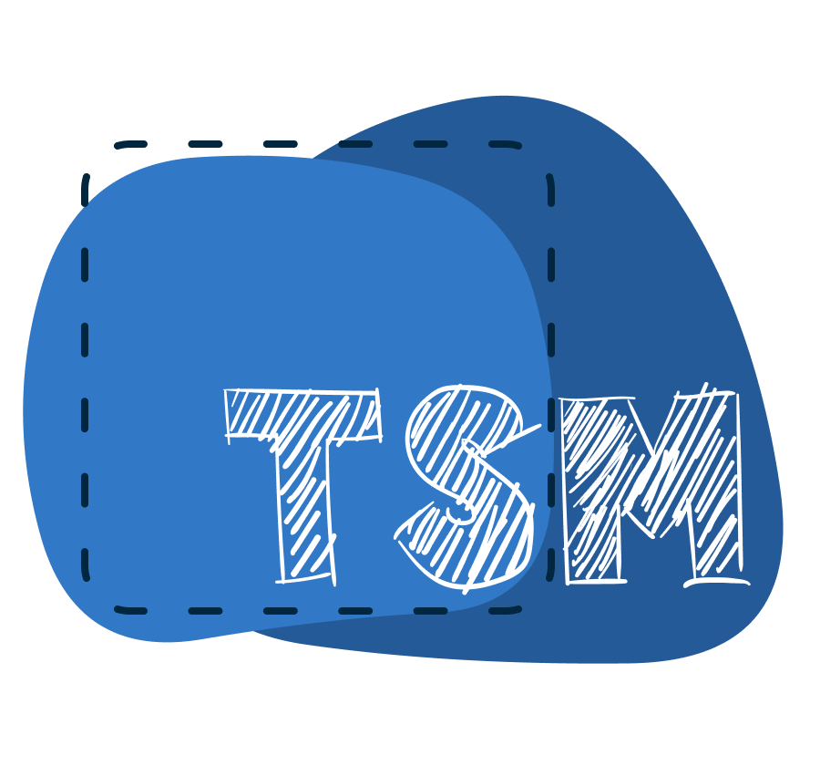

<div align="center">
  
</div>

<div align="center">
  <a href="https://npmjs.org/package/tsm">
    
  </a>
  <a href="https://github.com/lukeed/tsm/actions">
    
  </a>
  <a href="https://npmjs.org/package/tsm">
    
  </a>
  <a href="https://packagephobia.now.sh/result?p=tsm">
    
  </a>
</div>

<div align="center">TypeScript Module Loader</div>

## Features

* Supports `node <file>` usage
* Supports [ESM `--loader`](https://nodejs.org/api/esm.html#esm_loaders) usage<sup>†</sup>
* Supports [`--require` hook](https://nodejs.org/api/cli.html#cli_r_require_module) usage
* Optional [configuration](/docs/configuration.md) file for per-extension customization

> <sup>†</sup> The ESM Loader API is still **experimental** and will change in the future.

## Install

```sh
# install as project dependency
$ npm install --save-dev tsm

# or install globally
$ npm install --global tsm
```

## Usage

> **Note:** Refer to [`/docs/usage.md`](/docs/usage.md) for more information.

```sh
# use as `node` replacement
$ tsm server.ts

# forwards any `node` ENV or flags
$ NO_COLOR=1 tsm server.ts --trace-warnings

# use as `--require` hook
$ node --require tsm server.tsx
$ node -r tsm server.tsx

# use as `--loader` hook
$ node --loader tsm main.jsx
```

## Difference with `ts-node`

- tsm uses esbuild, so it's much faster
- tsm can be run without any configuration by default
- tsm offers a configuration file that allows you to use/import far more than just JS/TS (html, css, blob urls, etc)
- tsm supports the `.mts` and `.cts` extensions
- tsm will auto-resolve the `.mts`/`.cts` file through an import to its `.mjs`/`.cjs` would-be output
- tsm works without a `tsconfig.json` file present, which means it can be run/installed globally
- tsm does not require `typescript` as a peer dependency
- tsm rewrites module formats on the fly so that you can use `tsm` in any way that suits your toolchain _without_ compromising the semantics of your code. AKA, it allows you to handle this test scenario, which would fail with `ts-node` (or even with `esm` if it were there were no TS involvement)

```js
// src/math.mjs
// or src/math.js w/ type: module
export const sum = (a, b) => a + b;

// test/math.ts
import * as assert from 'assert';
import * as math from '../src/math.mjs';

assert.equal(math.sum(1, 2), 3);
```

run it via:

```shell
$ node -r tsm test/math.ts # works
$ node -r ts-node/register test/math.ts # fails
$ node -r ts-node/register/transpile-only test/math.ts # fails

$ tsm test/math.ts # success
$ ts-node --transpile-only test/math.ts # fails

$ node --loader tsm test/math.ts # success
$ node --loader ts-node/esm/transpile-only test/math.ts # fails UNLESS:
# - you have `"type": "module"` in package.json
# - you have `tsconfig.json` file with `"module": "esnext"` or equivalent
```

Overall, tsm is much faster and does not have all the same friction issues. It's effectively a blend between a bundler and a runtime transformer, offering complete flexibility (for extensions & for tooling integration) and without compromising any of the import/export semantics of your files.

## License

MIT © [Luke Edwards](https://lukeed.com)
